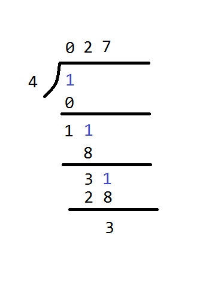

# 1015. Smallest Integer Divisible by K

## Code:

```cpp
int smallestRepunitDivByK(int K) {
    if (K % 2 == 0 || K % 5 == 0) return -1;

    int len = 1;
    int num = 1;
    while (num % K) {
        num = (num % K) * 10 + 1;
        ++len;
    }
    return len;
}
```

A better version:

```cpp
int smallestRepunitDivByK(int K) {
    if (K % 2 == 0 || K % 5 == 0) return -1;

    int num = 0;
    for (int n = 1; n <= K; ++n) {
        num = (num * 10 + 1) % K;
        if (num == 0) return n;
    }

    return -1;
}
```

## 原理解釋

為什麼只需要試到 K個1 就可以停了？

最直觀就是開始出現循環了

例子1：



上圖中，餘數 3 再次出現

例子2：

```
1 % 6 = 1
11 % 6 = 5
111 % 6 = 3
1111 % 6 = 1
11111 % 6 = 5
111111 % 6 = 3
```

### 詳細解釋

當 K 是 2 或 5 時，顯然沒有解，

但當 K 不是 2 或 5 時，在 [1, 11, 111, ..., K個1] 當中必定有 K 的倍數出現，為什麼？

解釋如下：

一個數除以K，它的餘數、範圍會落在 [0, K-1] 之間，

以 K = 6 為例，當無法整除、餘數不為0時，餘數會是在 [1, 5] 之間共5個數。

* 假設 [1, 11, 111, ......, 111..111] 共K個侯選數字裡，都找不到可以整除K的數

  那麼裡面至少有2個餘數是一樣的。（K-1個餘數，塞進K個格子裡）；
  
  > PS: 鴿巢原理（10隻鴿子放進9個鴿籠，那麼一定有一個鴿籠放進了至少兩隻鴿子）

* 如果侯選數字 a < b, 而它們的餘數是相等的

  那麼 b - a 就可以被 K 整除，是 K 的倍數；

* 比如說 b 是 111111、而 a 是 111，那麼 b - a 就等於 111000

  而 111000 = 111 * 1000

  兩個因子中，1000 不是 K 的因子（K不是2或5），那麼 111 就是 K 的因子了

  但這就和一開始第1點的假設矛盾了，[1, 11, 111, ..., K個1] 裡面沒有可以整除 K 的數字。


reference:

https://leetcode.com/problems/smallest-integer-divisible-by-k/discuss/260852/JavaC%2B%2BPython-O(1)-Space-with-Proves-of-Pigeon-Holes

https://leetcode.com/problems/smallest-integer-divisible-by-k/discuss/260916/Proof%3A-we-only-need-to-consider-the-first-K-candidates-in-1-11-111-1111-
