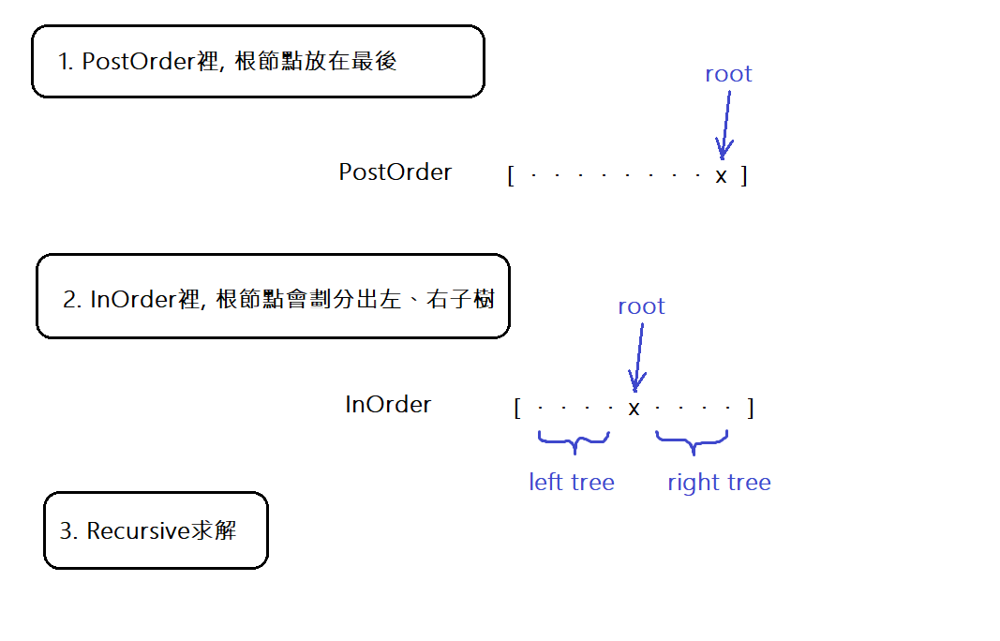

# 106. Construct Binary Tree from Inorder and Postorder Traversal



## 最初 Accepted 的版本

```cpp
TreeNode* buildTree(vector<int>& inorder, vector<int>& postorder) {
    return buildTree(inorder, 0, inorder.size()-1, postorder);
}

TreeNode* buildTree(vector<int>& inorder, int inStart, int inEnd, vector<int>& postorder) {
    if (inStart > inEnd) return nullptr;

    TreeNode* root = new TreeNode(postorder.back());
    postorder.pop_back();

    for (int i = inStart; i <= inEnd; i++) {
        if (inorder[i] == root->val) {
            root->right = buildTree(inorder, i+1, inEnd, postorder);
            root->left = buildTree(inorder, inStart, i-1, postorder);
            break;
        }
    }
    return root;
}
```

## 優化後的版本

在 inorder 裡查找元素對應 root 下標的過程，可以通過 hashmap 來優化:

```cpp
TreeNode* buildTree(vector<int>& inorder, vector<int>& postorder) {
    unordered_map<int, int> m;
    for (int i = 0; i < inorder.size(); i++)
        m[inorder[i]] = i;

    int pRoot = postorder.size() - 1;
    return buildTree(m, 0, inorder.size()-1, postorder, pRoot);
}

TreeNode* buildTree(unordered_map<int, int>& m, int inStart, int inEnd, vector<int>& postorder, int& pRoot) {
    if (inStart > inEnd) return nullptr;

    TreeNode* root = new TreeNode(postorder[pRoot--]);

    root->right = buildTree(m, m[root->val]+1, inEnd, postorder, pRoot);
    root->left = buildTree(m, inStart, m[root->val]-1, postorder, pRoot);

    return root;
}
```
