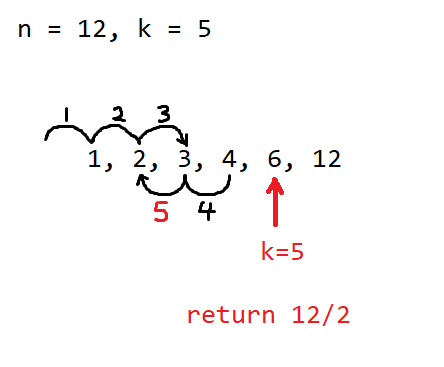

# 1492. The kth Factor of n

## 1492_01.cpp

可以觀察到，一個數字的因子最多只會去到該數字的一半

```
12
1, 2, 3, 4, 6, 12

25
1, 5, 25
```

所以可以寫出代碼：

```cpp
int kthFactor(int n, int k) {
    int cnt = 0;

    for (int i = 1; i <= n / 2; ++i) {
        if (n % i == 0) ++cnt;
        if (cnt == k) return i;
    }
    if (++cnt == k) return n; 

    return -1;
}
```

寫簡潔一點：

```cpp
int kthFactor(int n, int k) {
    for (int x = 1; x <= n / 2; ++x)
        if (n % x == 0 && --k == 0)
            return x;

    return k == 1 ? n : -1;;
}
```

Time: O(N/2) -> O(N)

## 1492_02.cpp

對於求因子問題，Time complexity 可以下降到 O(sqrt(N))，可以想像成在走回頭路，例子：



要注意，對於符合 n = x^2 的數字要特殊處理，比如 9, 25，因為 x = n/x，所以要自己多走一步

```cpp
int kthFactor(int n, int k) {
    int x;

    for (x = 1; x * x <= n; ++x)
        if (n % x == 0 && --k == 0) return x;

    --x;
    for (x = (x * x == n ? x - 1 : x); x >= 1; --x) { // 因為 x = n/x，所以要自己多走一步
        if (n % x == 0 && --k == 0) return n / x;
    }

    return -1;
}
```

or

```cpp
int kthFactor(int n, int k) {
    float root = sqrt(n);

    for (int x = 1; x < root; ++x)
        if (n % x == 0 && --k == 0) return x;

    for (int x = root; x >= 1; --x)
        if (n % x == 0 && --k == 0) return n / x;

    return -1;
}
```

Time: O(sqrt(N))
