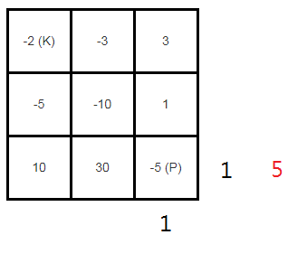

# 174. Dungeon Game

使用DP來解題

這個問題的注意點就是，要由終點位置（公主）開始，推到起始位置（騎士）。

推導過程：



每一格的可剩餘HP是由右面和下面決定的，那如何決定選右面還是下面？舉個例子，如像圖中紅字所示，

假設走到公主的右面後，剩5點HP，代表騎士移動前有10點HP

假設走到公主的下面，剩1點HP，代表騎士移動前有6點HP

我們目標是用盡量少的HP完成任務，所以會選下面，也就是說，選擇移動後剩餘HP少的一面
```
min(hp[y + 1][x], hp[y][x + 1])
```
然後移動前的HP就是
```
min(hp[y + 1][x], hp[y][x + 1]) - dungeon[y][x]
```
dp數組的含義是：在扣血（扣掉當前格子數）前需要有的HP。

這個減法有可能會減出負數，而騎士移動前最少只要1點HP就足夠，所以推導公式就是：
```
hp[y][x] = max(1, min(hp[y + 1][x], hp[y][x + 1]) - dungeon[y][x]);
```

最後，建hp數組的大小要比dungeon多一欄和一列，初始化公主起始位置的右面和下面為1，其他取最大INT_MAX

