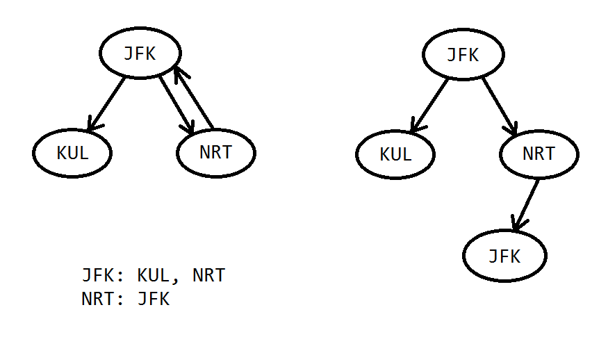

# 332. Reconstruct Itinerary

## 332_01.cpp
最開始嘗試普通DFS、沒有剪枝，

把所有可行路徑都找出來，然後每找到一條路徑```cur```、都和目前記錄的答案路徑```ans```對比字母順序，字母序較少就更少```ans```。

結果TLE。

## 332_02.cpp
Post order traversal 方法，學習了別人的做法。

在理解這個方法時，要注意 <strong>先遇到死路</strong> 的情況，比如下圖



遍歷 ```JFK``` 時會按字母順序，先拿出 ```KUL```，但 ```KUL``` 是死路，所以會先放到結果裡，

然後再遍歷右子樹 ```NRT```，```NRT``` 又會去 ```JFK```。

這裡會讓人疑惑，遍歷完右子樹/剩下的子樹後，怎麼保證最後一定會回到左子樹？

其實關鍵是題目保證一定有解，而 ```JFK -> KUL``` 是死路的話，代表最後一定會有路徑是回到 ```JFK```，再由 ```JFK -> KUL```

遍歷順序是 ```KUL -> JFK -> NRT -> JFK```

所以答案是 ```JFK -> NRT -> JFK -> KUL```

```cpp
class Solution {
public:
    vector<string> findItinerary(vector<vector<string>>& tickets) {
        for (const vector<string>& t : tickets) {
            _trips[t[0]].push_back(t[1]);
        }
        
        for (auto& it : _trips) {
            auto& dests = it.second;
            std::sort(dests.begin(), dests.end());
        }
        
        postOrderTraversal("JFK");
        
        return vector<string>(_route.rbegin(), _route.rend());
    }
    
private:
    unordered_map<string, deque<string>> _trips;
    vector<string> _route;
    
    void postOrderTraversal(string root) {
        auto& dests = _trips[root];
        while (!dests.empty()) {
            const string dest = dests.front();
            dests.pop_front();
            postOrderTraversal(dest);
        }
        _route.push_back(root);
    }
};
```

參考：

https://www.youtube.com/watch?v=4udFSOWQpdg
