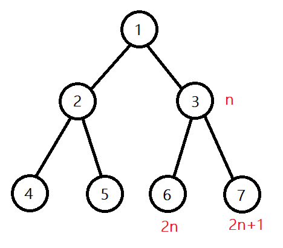

# 662. Maximum Width of Binary Tree

每個節點位於哪個位置，都是可以根據父節點計算出來的，queue 裡保存節點及位置:



```cpp
int widthOfBinaryTree(TreeNode* root) {
    long max_cnt = 0;

    queue<pair<TreeNode*, long>> q;

    q.push(pair<TreeNode*, int>{root, 1});
    while (!q.empty()) {
        long r = q.front().second, l = r;
        int size = q.size();
        for (int i = 0; i < size; i++) {
            auto* node = q.front().first;
            r = q.front().second;
            q.pop();
            if (node->left) q.push(pair<TreeNode*, int>{node->left, r*2});
            if (node->right) q.push(pair<TreeNode*, int>{node->right, r*2+1});
        }
        max_cnt = max(max_cnt, r-l+1);
    }
    return max_cnt;
}
```
