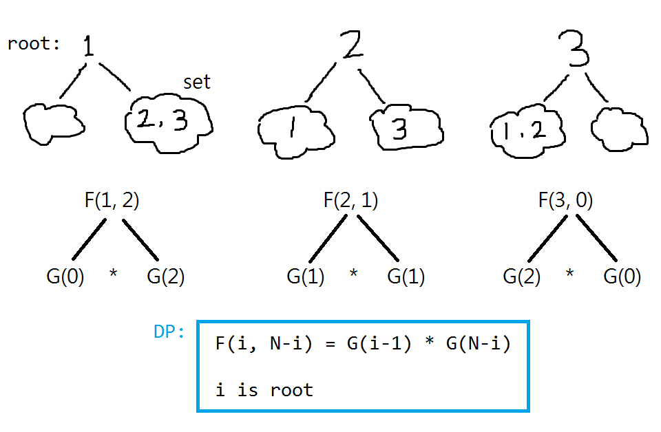

# 96. Unique Binary Search Trees

## Solution: DP



```F(i, n) = G(i-1) * G(n-i)```

其中```i```是作為```root```的數字

```G(i-1)```是左子樹的組合數目

```G(n-i)```是右子樹的組合數目

```cpp
class Solution {
public:
    int numTrees(int n) {
        vector<int> G(n+1, 0);
        G[0] = 1;

        for (int i = 1; i <= n; i++) {
            for (int root = 1; root <= i; root++) {
                G[i] += G[root-1] * G[i-root];
            }
        }
        return G[n];
    }
};
```

參考：

https://www.youtube.com/watch?v=GgP75HAvrlY
